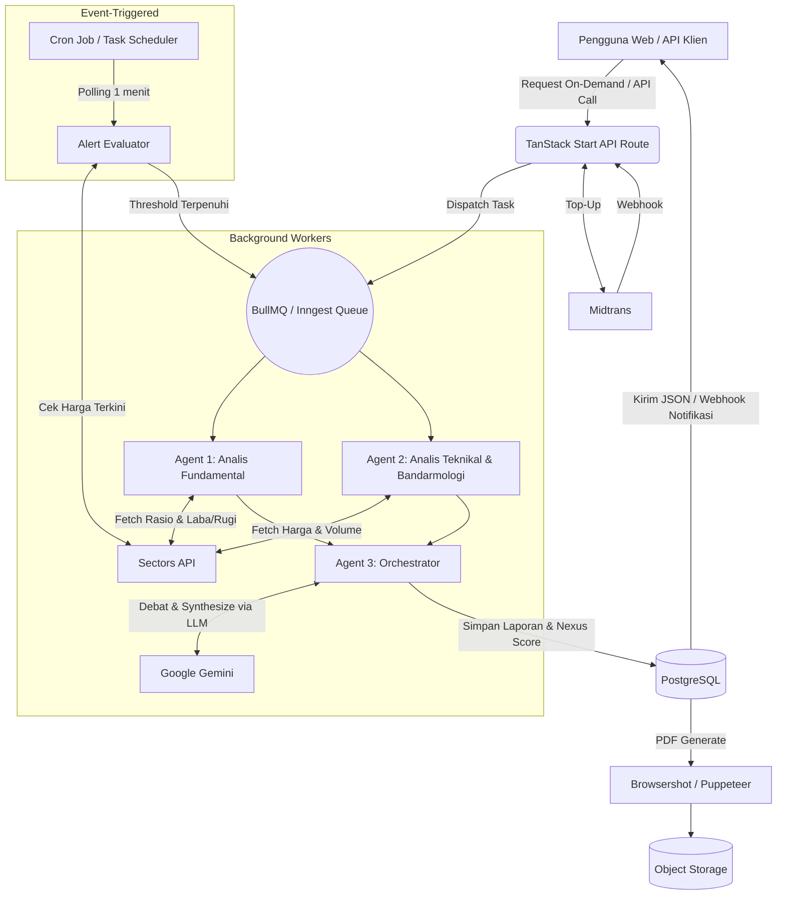
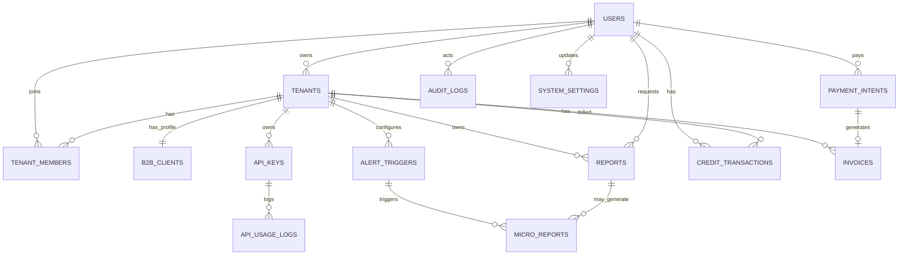

# PRD — Project Requirements Document: NexusCapital (v2.0 Final)

## 1. Overview
NexusCapital adalah platform intelijen pasar dan pembuat laporan riset institusional berbasis AI (AI Agents & Assistants). Aplikasi ini mendemokratisasi akses informasi finansial dengan mengubah data mentah dari pasar saham Indonesia menjadi riset komprehensif, skor analitik berpemilik (Nexus Score), dan peringatan otomatis dalam hitungan detik.

**Masalah yang diselesaikan**
* Investor ritel tidak punya akses ke laporan riset ekuitas komprehensif yang biasanya hanya untuk klien institusi.
* Pembuatan laporan riset manual lambat dan kehilangan momentum pasar.
* Sulit memproses data fundamental, teknikal, dan bandarmologi secara bersamaan untuk perbandingan peers.
* Kurangnya kontrol operasional terpusat bagi penyedia B2B untuk memantau API dan biaya LLM.

**Tujuan utama**
* Menghasilkan laporan riset saham One-Pager via Multi-Agent AI (Fundamental, Teknikal/Bandarmologi, Orkestrator).
* Menyediakan Nexus Score (1–100) untuk perbandingan peers instan.
* Menjalankan Event-Triggered Micro-Reports secara otonom.
* Menyediakan layanan B2B SaaS White-label via API.
* Menyediakan Admin Back-Office untuk mengelola user, biaya, dan kesehatan sistem.

## 2. Requirements

### 2.1 Functional
* Multi-agent LLM berinteraksi di background sebelum output akhir.
* Agen menarik data eksternal (Sectors API): rasio & laba/rugi (fundamental); harga, volume, akumulasi (teknikal/bandarmologi).
* Sistem menghitung Nexus Score berbasis pembobotan AI terhadap peers.
* Scheduler/cron memantau trigger otonom dan merilis micro report.
* UI interaktif dengan chart historis (revenue/profit/price).
* Waktu pemrosesan prompt → laporan selesai ≤ 40 detik (p95), via asynchronous queue.
* RBAC memisahkan retail, B2B, dan admin.
* Mendukung bilingual: Bahasa Indonesia & English.
* Payment gateway (Midtrans) untuk top-up kredit.

### 2.2 Non-Functional (ringkas)
* Uptime ≥ 99.5%.
* p95 full report ≤ 40 detik; p99 ≤ 60 detik.
* API read < 300 ms.
* Cost control: alert $50/hari, kill switch otomatis $100/hari.
* Audit log wajib untuk semua aksi admin.
* Disclaimer "bukan rekomendasi investasi" di PDF & UI.

## 3. Core Features

### 3.1 Landing Page & Autentikasi
* Value proposition Multi-Agent, otomatisasi, API.
* Registrasi B2C (personal) & B2B (institusi).
* Bilingual ID/EN.

### 3.2 Multi-Agent Research Generator
* Input ticker (contoh: PGEO, NEST, MBMA).
* Loading state transparan menampilkan alur agen:
  * Agent 1 (Fundamental): laporan keuangan, pertumbuhan pendapatan, valuasi.
  * Agent 2 (Teknikal & Bandarmologi): aksi harga, support/resistance, volume, akumulasi.
  * Agent 3 (Orchestrator): sintesis temuan, resolusi bias, Executive Summary, Risk Warnings.
* Pilihan bahasa output (ID/EN).

### 3.3 Nexus Score & Interactive Report Viewer
* One-Pager report.
* Gauge Nexus Bull/Bear Score.
* Chart interaktif: performa ticker vs peers.
* Export PDF (server-side render).

### 3.4 Event-Triggered Micro-Reports
* Contoh aturan: "Kirim analisis kilat jika PTMP, WIFI, atau TOBA turun > 5% dalam satu sesi."
* Polling 1 menit saat market hours (Senin–Jumat 09:00–15:30 WIB).
* Cooldown & dedup untuk cegah spam.
* Kirim via email & webhook.

### 3.5 B2B White-Label & API Gateway
* Manajemen API Key.
* REST API untuk Generate Full Report.
* Webhook event.
* White-label logo pada PDF.
* Usage & billing dashboard.

### 3.6 Admin Back-Office
* User & Billing Management: saldo/kredit, block user.
* B2B Tenant Approval: verifikasi & aktivasi.
* Payment & Refund Management.
* Cost & API Monitoring: token LLM, request API, estimasi biaya.
* Queue / System Health: BullMQ / Inngest Dashboard (pending, failed, retry).
* Kill Switch: matikan micro-report otomatis.
* Audit Logs.
* System Settings.

## 4. User Flow

### Flow A — On-Demand Research (B2C)
1. User login ke dashboard.
2. Input ticker di search bar (contoh: "Buatkan analisis lengkap untuk MBMA").
3. Sistem dispatch job ke queue: Agent 1 & Agent 2 paralel.
4. User melihat animasi agen berinteraksi.
5. ≤ 40 detik: One-Pager + Nexus Score selesai.
6. User interaksi dengan chart & baca risk warnings.
7. Kredit dipotong 10 (full report).

### Flow B — Event-Triggered (B2B/Pro)
1. Klien set: `IF ticker IN [ANTM, PGEO] drops > 5% THEN generate_micro_report`.
2. Cron polling tiap 1 menit saat market hours.
3. Trigger terpenuhi → sistem panggil Orchestrator.
4. Micro report dikirim via webhook + email.
5. Kredit dipotong 2 per micro report.

### Flow C — Top-Up Kredit
1. User buka halaman Billing.
2. Pilih paket kredit.
3. Midtrans Snap terbuka → user bayar (QRIS/VA/e-wallet/kartu).
4. Midtrans kirim webhook POST `/webhooks/midtrans`.
5. Sistem verifikasi signature → kredit ditambah.
6. Notifikasi email + in-app.

### Flow D — Operasional Admin
1. Admin login → `/admin-dashboard`.
2. Lihat statistik laporan & estimasi biaya token hari ini.
3. Approve/reject pendaftaran B2B.
4. Pantau queue. Retry job yang failed (tanpa potong saldo).
5. Proses refund manual jika diperlukan.
6. Aktifkan kill switch jika market crash.

## 5. Architecture



### Komponen Utama
* Public Website: landing page, pricing, auth.
* API Routes (TanStack Start): auth, rate limit, dispatch queue.
* Multi-Agent Workers: Agent 1, 2, 3 di BullMQ / Inngest queue.
* Scheduler: cron polling alert.
* Report Engine: orchestrasi agent, scoring, PDF.
* Billing Engine: Midtrans, credit ledger.
* Admin Back-Office: monitoring, approval, kill switch.
* Tenant Isolation: semua data B2B terikat tenant_id.

## 6. Database Schema

### 6.1 Tabel Inti

**users**
* id — uuid, PK
* name — string
* email — string, unique
* role — enum: retail, b2b_client, b2b_admin, admin
* password_hash — string
* credit_balance — integer, default 20
* default_tenant_id — uuid, FK to tenants, nullable
* status — enum: active, suspended, blocked, default active
* locale — enum: id, en, default id
* last_login_at — timestamp, nullable
* created_at — timestamp

**tenants**
* id — uuid, PK
* name — string
* slug — string, unique
* owner_user_id — uuid, FK to users
* status — enum: pending, active, suspended, rejected, default pending
* plan — enum: free, pro, enterprise, default free
* created_at, updated_at — timestamp

**tenant_members**
* id — uuid, PK
* tenant_id — uuid, FK to tenants
* user_id — uuid, FK to users
* role — enum: owner, admin, member, viewer
* created_at — timestamp

**b2b_clients**
* id — uuid, PK
* tenant_id — uuid, FK to tenants, unique
* company_name — string
* webhook_url — string, nullable
* white_label_logo_url — string, nullable
* is_approved — boolean, default false
* approved_by — uuid, FK to users, nullable
* approved_at — timestamp, nullable
* created_at, updated_at — timestamp

**api_keys**
* id — uuid, PK
* tenant_id — uuid, FK to tenants
* created_by_user_id — uuid, FK to users
* name — string
* key_prefix — string
* key_hash — string
* scopes — json
* last_used_at — timestamp, nullable
* expires_at — timestamp, nullable
* revoked_at — timestamp, nullable
* created_at — timestamp

**reports**
* id — uuid, PK
* user_id — uuid, FK to users
* tenant_id — uuid, FK to tenants, nullable
* ticker — string
* report_type — enum: full, micro
* language — enum: id, en, default id
* status — enum: queued, processing, completed, failed
* nexus_score — integer, nullable
* score_label — string, nullable
* fundamental_analysis — text
* technical_analysis — text
* final_synthesis — text
* raw_data_snapshot — json
* pdf_url — string, nullable
* request_id — string, unique
* tokens_used — integer, nullable
* cost_estimate — decimal, nullable
* processing_time_ms — integer, nullable
* error_message — text, nullable
* completed_at — timestamp, nullable
* created_at — timestamp

**alert_triggers**
* id — uuid, PK
* user_id — uuid, FK to users
* tenant_id — uuid, FK to tenants, nullable
* ticker — string
* condition_type — enum: price_drop, price_spike, volume_spike
* threshold_percent — decimal
* cooldown_minutes — integer, default 30
* max_triggers_per_day — integer, default 10
* is_active — boolean, default true
* last_triggered_at — timestamp, nullable
* created_at — timestamp

**micro_reports**
* id — uuid, PK
* trigger_id — uuid, FK to alert_triggers
* tenant_id — uuid, FK to tenants, nullable
* report_id — uuid, FK to reports, nullable
* narrative_report — text
* dispatched_to_webhook — boolean, default false
* webhook_status — enum: pending, sent, failed, default pending
* webhook_attempts — integer, default 0
* created_at — timestamp

**credit_transactions**
* id — uuid, PK
* user_id — uuid, FK to users, nullable
* tenant_id — uuid, FK to tenants, nullable
* type — enum: topup, deduction, refund, admin_adjustment, bonus, reservation, release
* amount — integer
* balance_before — integer
* balance_after — integer
* reference_type — string, nullable
* reference_id — uuid, nullable
* description — text
* created_by — uuid, FK to users, nullable
* created_at — timestamp

**payment_intents**
* id — uuid, PK
* user_id — uuid, FK to users
* tenant_id — uuid, FK to tenants, nullable
* provider — enum: midtrans, stripe
* provider_reference — string, unique
* amount — decimal
* currency — string
* credits — integer
* status — enum: pending, paid, expired, failed, refunded
* paid_at — timestamp, nullable
* expires_at — timestamp
* raw_response — json
* created_at — timestamp

**invoices**
* id — uuid, PK
* tenant_id — uuid, FK to tenants
* payment_intent_id — uuid, FK to payment_intents, nullable
* invoice_number — string, unique
* amount — decimal
* status — enum: draft, sent, paid, void
* due_date — date
* paid_at — timestamp, nullable
* pdf_url — string, nullable
* created_at — timestamp

**api_usage_logs**
* id — uuid, PK
* tenant_id — uuid, FK to tenants, nullable
* api_key_id — uuid, FK to api_keys, nullable
* endpoint — string
* method — string
* status_code — integer
* request_id — string
* credits_used — integer
* tokens_in — integer
* tokens_out — integer
* cost_estimate — decimal
* latency_ms — integer
* created_at — timestamp

**audit_logs**
* id — uuid, PK
* actor_user_id — uuid, FK to users
* tenant_id — uuid, FK to tenants, nullable
* action — string
* entity_type — string
* entity_id — uuid, nullable
* old_values — json, nullable
* new_values — json, nullable
* ip_address — string, nullable
* user_agent — string, nullable
* created_at — timestamp

**system_settings**
* id — uuid, PK
* key — string, unique
* value — string
* type — enum: string, boolean, integer, json
* description — text
* is_public — boolean, default false
* updated_by — uuid, FK to users
* updated_at — timestamp

### 6.2 ERD



## 7. API Specification

### 7.1 Base & Auth
* Base URL: `https://api.nexuscapital.id/v1`
* Auth B2B: `Authorization: Bearer <api_key>` atau `X-API-Key`
* Auth web: Better Auth
* Header wajib: `X-Request-Id` untuk idempotency.

### 7.2 Endpoints — Reports

| Method | Endpoint | Deskripsi |
| :--- | :--- | :--- |
| POST | `/reports` | Generate full report |
| GET | `/reports/{id}` | Ambil detail report |
| GET | `/reports/{id}/pdf` | Download PDF |
| GET | `/reports` | List report (filter) |

**Contoh request:**
```json
POST /reports
{
  "ticker": "PGEO",
  "report_type": "full",
  "locale": "id",
  "webhook_url": "https://client.com/hook"
}
```

**Response 202:**
```json
{
  "report_id": "rpt_123",
  "status": "queued",
  "estimated_seconds": 35,
  "credits_reserved": 10
}
```

### 7.3 Endpoints — Alerts

| Method | Endpoint | Deskripsi |
| :--- | :--- | :--- |
| POST | `/alerts` | Buat trigger |
| GET | `/alerts` | List trigger |
| PATCH | `/alerts/{id}` | Update trigger |
| DELETE | `/alerts/{id}` | Hapus trigger |

### 7.4 Endpoints — Usage & Credits

| Method | Endpoint | Deskripsi |
| :--- | :--- | :--- |
| GET | `/usage` | Statistik pemakaian |
| GET | `/credits/balance` | Saldo kredit |
| GET | `/credits/transactions` | Riwayat transaksi |

### 7.5 Endpoints — Billing

| Method | Endpoint | Deskripsi |
| :--- | :--- | :--- |
| POST | `/billing/topup` | Buat payment intent |
| GET | `/billing/packages` | List paket kredit |
| GET | `/billing/invoices` | List invoice B2B |

### 7.6 Webhook Events (Outgoing)
* `report.completed`
* `report.failed`
* `micro_report.created`
* `alert.triggered`

**Payload:**
```json
{
  "event": "report.completed",
  "request_id": "req_abc",
  "data": { "report_id": "rpt_123", "ticker": "PGEO", "nexus_score": 82, "pdf_url": "..." },
  "sent_at": "2026-01-01T10:00:35Z"
}
```

### 7.7 Webhook Events (Incoming)
* `POST /webhooks/midtrans` — notifikasi pembayaran.

### 7.8 Error Codes
400, 401, 403, 404, 409, 422, 429, 500, 503.

### 7.9 Rate Limit
* Default B2B: 60 req/menit per API key.
* Generate report: 10 req/menit per tenant.
* Alert create: 30 req/menit per tenant.
* Header: `X-RateLimit-Limit`, `X-RateLimit-Remaining`, `Retry-After`.

## 8. Credit & Billing Rules (Final)

### 8.1 Nilai Kredit

| Aksi | Kredit |
| :--- | :--- |
| Full Report | 10 |
| Micro Report | 2 |
| API read-only | 0 |
| API generate report | sesuai full/micro |

### 8.2 Alur Kredit
* Request masuk → reserve kredit.
* Sukses → potong permanen.
* Gagal sistem (LLM/API down) → refund.
* Gagal input user (ticker invalid) → tidak refund.
* Admin bisa adjust manual kapan saja.
* Semua tercatat di `credit_transactions`.

### 8.3 Default Saldo
* Retail baru: 20 kredit.
* B2B: kuota bulanan sesuai plan.
* Admin: unlimited.

### 8.4 Paket Top-Up

| Paket | Kredit | IDR | USD (Fase 2) |
| :--- | :--- | :--- | :--- |
| Starter | 50 | Rp 75.000 | $5 |
| Pro | 200 | Rp 275.000 | $18 |
| Business | 500 | Rp 625.000 | $40 |
| Enterprise | Custom | Custom | Custom |

### 8.5 Payment Gateway
* MVP: Midtrans (QRIS, VA BCA/BNI/BRI/Mandiri/Permata, GoPay, OVO, DANA, ShopeePay, Kartu).
* Fase 2: Stripe untuk klien internasional (USD).
* Webhook signature wajib diverifikasi.

### 8.6 Refund
* Hanya untuk kegagalan sistem.
* MVP: manual oleh admin.
* Fase 2: otomatis via Midtrans refund API.

## 9. Queue & Job Lifecycle

### 9.1 Queue Names
* `reports-high` — B2B / prioritas
* `reports-default` — retail
* `micro-reports` — event-triggered
* `webhooks` — dispatch webhook
* `default` — job umum

### 9.2 Jobs
* `GenerateFullReportJob`
* `GenerateMicroReportJob`
* `DispatchWebhookJob`
* `EvaluateAlertsJob`

### 9.3 Timeout & Retry
* Agent 1: 10 dtk
* Agent 2: 10 dtk
* Agent 3: 20 dtk
* Total job: 50 dtk (buffer)
* Retry: 3× (backoff 5s, 15s, 45s)
* Setelah gagal: status failed, refund kredit jika kesalahan sistem.

### 9.4 Idempotency
* `request_id` unik per request.
* Job tidak memproses `request_id` duplikat.

### 9.5 Queue Management
* Supervisor terpisah per queue.
* Admin bisa retry job failed.
* `failed_jobs` sebagai dead letter queue.

### 9.6 LLM Integration
* Provider: Google Gemini.
* Model spesifik: ditentukan saat implementasi (rencana: Gemini Flash untuk Agent 1 & 2, Gemini Pro untuk Orchestrator).
* Structured output via `responseSchema`.
* Fallback: jika Gemini down → status Service Unavailable, refund kredit.

## 10. Event-Triggered Micro-Reports

### 10.1 Aturan Trigger
* `condition_type`: `price_drop`, `price_spike`, `volume_spike`.
* Threshold persen.
* Polling 1 menit saat market hours.
* Market hours: Senin–Jumat, 09:00–15:30 WIB.
* Di luar market hours: polling nonaktif.

### 10.2 Cooldown & Dedup
* Cooldown default: 30 menit per trigger.
* Cooldown per ticker per user: 60 menit.
* Max trigger per user per hari: 10.
* Max active triggers per user: 20.

### 10.3 Kill Switch
* `system_settings.micro_report_kill_switch = true` → matikan semua evaluasi.
* Admin bisa nyalakan kembali.

### 10.4 Webhook Retry
* 3×: 10 dtk, 1 menit, 5 menit.
* Gagal → `webhook_status=failed`, admin bisa resend manual.

## 11. RBAC & Security

### 11.1 Role
`retail`, `b2b_client`, `b2b_admin`, `admin`.

### 11.2 Matrix Izin

| Aksi | Retail | B2B Client | B2B Admin | Admin |
| :--- | :---: | :---: | :---: | :---: |
| Generate full report | ✅ | ✅ | ✅ | ✅ |
| Lihat report sendiri | ✅ | ✅ | ✅ | ✅ |
| Lihat report tenant | ❌ | ✅ | ✅ | ✅ |
| Kelola API key | ❌ | ❌ | ✅ | ✅ |
| Kelola alert | ✅ | ✅ | ✅ | ✅ |
| Approve B2B | ❌ | ❌ | ❌ | ✅ |
| Ubah kredit | ❌ | ❌ | ❌ | ✅ |
| Block user | ❌ | ❌ | ❌ | ✅ |
| Kill switch | ❌ | ❌ | ❌ | ✅ |
| Cost monitoring | ❌ | ❌ | ✅ | ✅ |
| Audit log | ❌ | ❌ | ❌ | ✅ |
| Refund payment | ❌ | ❌ | ❌ | ✅ |

### 11.3 API Key Security
* Ditampilkan sekali saat dibuat.
* Disimpan hashed.
* Bisa revoke, rotate, expiry.
* Scopes terbatas.

### 11.4 Audit Log
* Semua aksi admin → `audit_logs`.
* Termasuk credit adjustment, B2B approval, block, kill switch.

## 12. Non-Functional Requirements

### 12.1 Performance
* p95 full report ≤ 40 dtk; p99 ≤ 60 dtk.
* API read < 300 ms.
* PDF generation < 5 dtk.

### 12.2 Scalability
* Worker horizontal.
* Redis terpisah dari DB.
* API Gateway non-blocking.

### 12.3 Availability
* Uptime target: 99.5%.

### 12.4 Security
* Enkripsi API key.
* Rate limit.
* RBAC.
* Audit log.
* Signed URL PDF.

### 12.5 Observability
* Structured logging.
* Metrics: job duration, token, error rate.
* Alert biaya harian.
* Tracing request_id.

### 12.6 Cost Control
* Max token per report: 20.000.
* Max cost per report: $0.05.
* Budget alert harian: $50.
* Kill switch otomatis: $100/hari.

### 12.7 Compliance
* Disclaimer "bukan rekomendasi investasi" di PDF & UI.
* Data retention: 12 bulan untuk report, 3 bulan untuk log mentah.
* Hak hapus sesuai kebijakan privasi.

### 12.8 Bilingual
* Output report mendukung ID & EN.
* UI toggle ID/EN.
* PDF mengikuti bahasa yang dipilih.

## 13. Nexus Score — Detail Final

### 13.1 Bobot

| Komponen | Bobot | Agen |
| :--- | :--- | :--- |
| Fundamental | 40% | Agent 1 |
| Technical | 30% | Agent 2 |
| Bandarmologi | 20% | Agent 2 |
| Risk | 10% | Agent 3 |

### 13.2 Skala

| Skor | Label |
| :--- | :--- |
| 80–100 | Strong Bull |
| 65–79 | Bull |
| 50–64 | Neutral |
| 35–49 | Bear |
| 1–34 | Strong Bear |

### 13.3 Perhitungan
`Score = (F × 0.4) + (T × 0.3) + (B × 0.2) + (R × 0.1)`
Orchestrator bisa adjust ±5 poin berdasarkan konteks. Dibulatkan ke integer.

## 14. UI/UX Screen Inventory

### 14.1 Public
* Landing Page
* Pricing
* Login/Register
* Public B2B page (opsional)

### 14.2 B2C Dashboard
* Dashboard
* Search ticker
* Report Generator (pilih bahasa)
* Report Viewer + Chart
* Nexus Score Gauge
* Export PDF
* Alert Settings
* Billing & Top-Up
* Credit Balance
* Transaction History

### 14.3 B2B Dashboard
* Dashboard tenant
* API Key Management
* Usage & Billing
* Invoice & Payment History
* Webhook Settings
* White-label Settings
* Team Members
* Report History
* Alert Management

### 14.4 Admin Back-Office
* Dashboard
* User Management
* B2B Tenant Approval
* Credit Adjustment
* Payment & Refund Management
* Cost & API Monitoring
* Queue / Horizon
* Kill Switch
* System Settings
* Audit Logs

### 14.5 UI States
* Loading transparan per agent.
* Empty, error, timeout, success.
* Mobile responsive.

## 15. MVP Scope, Out of Scope, Roadmap

### 15.1 MVP
* Landing page & auth (ID/EN)
* Multi-agent full report (Gemini)
* Nexus Score (40/30/20/10)
* Report viewer + chart
* Export PDF (server-side)
* Alert trigger (1 menit, market hours)
* Micro report dasar
* B2B API key
* Admin approval B2B
* Payment gateway Midtrans
* Cost monitoring + kill switch otomatis
* Queue health (BullMQ / Inngest Dashboard)
* Bilingual ID/EN

### 15.2 Out of Scope MVP
* Stripe
* Mobile app
* Real-time streaming
* Auto-trading
* WhatsApp Business API
* Custom domain white-label
* OAuth untuk API
* Advanced backtesting

### 15.3 Roadmap Fase 2
* Stripe
* WhatsApp API
* Custom domain
* OAuth
* Subscription otomatis
* Multi-language tambahan
* Portfolio tracking

## 16. Success Metrics & Risks

### 16.1 Metrics
* Report success rate > 95%.
* Avg processing time < 40 dtk.
* Cost per report < $0.05.
* API uptime > 99.5%.
* Weekly active users.
* B2B retention.
* Alert trigger accuracy.

### 16.2 Risks & Mitigasi

| Risiko | Dampak | Mitigasi |
| :--- | :--- | :--- |
| Halusinasi LLM | Laporan menyesatkan | Validasi data, disclaimer, human review opsional |
| Sectors API down | Report gagal | Retry, cache, fallback provider |
| Biaya token melonjak | Cost overrun | Max token, budget alert, kill switch |
| Trigger spam | Webhook/email spam | Cooldown, dedup, max trigger |
| Data licensing | Legal | Perjanjian dengan provider |
| Kebocoran API key | Abuse | Hash, rotate, revoke, scopes |
| Queue menumpuk | Timeout | Horizon, auto-scale, prioritas |
| Payment fraud | Kerugian | Verifikasi signature Midtrans, monitoring anomali |

## 17. Tech Stack

| Layer | Teknologi |
| :--- | :--- |
| Backend & Orkestrasi | TanStack Start (Node.js) |
| Queue | BullMQ (via Redis) atau Inngest |
| Frontend | React + Vite + TanStack Router |
| Visualisasi | Recharts |
| Database | PostgreSQL (Drizzle ORM) |
| LLM | Google Gemini |
| Market Data | Sectors API |
| Payment | Midtrans (MVP), Stripe (Fase 2) |
| PDF | Puppeteer / React-pdf |
| Storage | S3-compatible |
| Auth | Better Auth + API Key |
| Monitoring | BullMQ Board / Inngest Dashboard |

## 18. Ringkasan Perubahan dari PRD Awal
* Tenancy B2B diperjelas (tenants, tenant_members, api_keys, api_usage_logs).
* ERD ditambahkan.
* API Specification lengkap.
* Credit & Billing dengan Midtrans dari MVP.
* Queue Lifecycle dengan Gemini timeout & retry.
* Event-Triggered polling 1 menit, market hours saja.
* RBAC disederhanakan (admin saja).
* NFR dengan cost control, bilingual, observability.
* Screen Inventory lengkap.
* MVP Scope tegas.
* Nexus Score bobot final 40/30/20/10.
* Audit log, payment_intents, credit_transactions, invoices sebagai tabel baru.
* Bilingual ID/EN di semua output.
* Default saldo retail 20 kredit.
* Max token 20.000 per report.
